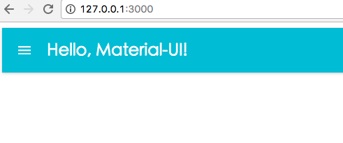

## Material-ui & webpack

### init project
<pre>
mkdir mui
cd mui
npm init

</pre>

### install packet
<pre>
$ npm install --save react react-dom react-tap-event-plugin material-ui
$ npm install --save-dev babel-core babel-loader
$ npm install --save-dev babel-preset-es2015 babel-preset-react babel-preset-stage-1
$ npm install --save-dev webpack
</pre>

`--save :` 表示生产环境依赖的库   
`--save-dev :` 表示开发环境依赖的库

执行完后，看package.json文件，如下：
<pre>
{
  "name": "mui",
  "version": "1.0.0",
  "description": "",
  "main": "index.js",
  "scripts": {
    "test": "echo \"Error: no test specified\" && exit 1"
  },
  "author": "",
  "license": "ISC",
  "dependencies": {
    "material-ui": "^0.16.1",
    "react": "^15.3.2",
    "react-dom": "^15.3.2",
    "react-tap-event-plugin": "^1.0.0"
  },
  "devDependencies": {
    "babel-core": "^6.18.2",
    "babel-loader": "^6.2.7",
    "babel-preset-es2015": "^6.18.0",
    "babel-preset-react": "^6.16.0",
    "babel-preset-stage-1": "^6.16.0",
    "webpack": "^1.13.3"
  }
}
</pre>

### 配置babel
在 package.json 中添加一个域"babel"，与之前的"dependencies" 同级。  
<pre>
  "babel": {
    "presets": [
      "es2015",
      "react",
      "stage-1"
    ],
    "plugins": []
  }
</pre>

### 配置 Webpack
在项目目录新建一个webpack.config.js ，并写入：
```js
const webpack = require('webpack');
const path = require('path');
const buildPath = path.resolve(__dirname, 'build');
const nodeModulesPath = path.resolve(__dirname, 'node_modules');

const config = {
  // Entry points to the project
  entry: [
    path.join(__dirname, '/static/app.js'),
  ],
  devtool: 'eval',
  output: {
    path: buildPath, // Path of output file
    filename: 'app.js',
  },
  plugins: [
    // Enables Hot Modules Replacement
    new webpack.HotModuleReplacementPlugin(),
    // Allows error warnings but does not stop compiling.
    new webpack.NoErrorsPlugin(),
  ],
  module: {
    loaders: [
      {
        // React-hot loader and
        test: /\.js$/, // All .js files
        loaders: ['babel-loader'], // react-hot is like browser sync and babel loads jsx and es6-7
        exclude: [nodeModulesPath],
      },
    ],
  },
};

module.exports = config;
```

新建 `static/app.js` 文件，如下：

```js
import React from 'react';
import ReactDOM from 'react-dom';
import getMuiTheme from 'material-ui/styles/getMuiTheme';
import MuiThemeProvider from 'material-ui/styles/MuiThemeProvider';
import AppBar from 'material-ui/AppBar';

const App = () => (
  <MuiThemeProvider muiTheme={getMuiTheme()}>
    <AppBar title="Hello, Material-UI!" />
  </MuiThemeProvider>
);

let app = document.createElement('div');
ReactDOM.render(<App />, app);
document.body.appendChild(app);
```

新建页面 index.html ，
```html
<!doctype html>
<html class="no-js" lang="">

<head>
  <meta charset="utf-8">
  <meta http-equiv="X-UA-Compatible" content="IE=edge">
  <title>Material-UI Example</title>
  <meta name="description" content="Google's material design UI components built with React.">
</head>

<body>
 <script src="build/app.js"></script>
</body>

</html>```


### 配置 npm 脚本
编辑package.json 中的 "scripts" 域：
<pre>
"scripts": {
    "build": "webpack",
    "build-dev": "webpack -w -d"
}
</pre>

接下来我们就可以在项目目录下使用简单的构建脚本了：  
$ npm run build

如果是开发中，可以使用监听式的Webpack，差量打包，提升效率。  
$ npm run build-dev

执行npm run build 后，生成最终文件，
```js
$ npm run build

> mui@1.0.0 build /Users/caidavis/Documents/webpack/mui
> webpack

Hash: 3b2db9dfd398171d10f8
Version: webpack 1.13.3
Time: 2652ms
 Asset     Size  Chunks             Chunk Names
app.js  1.21 MB       0  [emitted]  main
   [0] multi main 28 bytes {0} [built]
    + 365 hidden modules
```
此时，会自动创建build目录，并生成app.js到此目录中


### 让应用跑起来

安装 webpack-dev-server, 是一个小型的Node.js Express服务器  
`$ npm install --save-dev webpack-dev-server`

配置 webpack.config.js , 添加下面配置：
```js
// Server Configuration options
  devServer: {
    contentBase: './', // Relative directory for base of server
    devtool: 'eval', // 当有任何报错的时候可以让你更加精确地定位到文件和行号
    hot: true, // Live-reload
    inline: true, //自动刷新
    port: 3000, // Port Number
    host: 'localhost', // Change to '0.0.0.0' for external facing server
  },
```

webpack-dev-server有两种模式支持自动刷新: iframe模式和inline模式。

webpac-dev-server支持Hot Module Replacement，即模块热替换，在前端代码变动的时候无需整个刷新页面，只把变化的部分替换掉。

entry段添加hot模块：  
```js
entry: [
   'webpack/hot/dev-server',
   'webpack/hot/only-dev-server',
    path.join(__dirname, '/static/app.js'),
  ],
```

plugins段添加HMR插件支持：
```js
plugins: [
    // Enables Hot Modules Replacement
    new webpack.HotModuleReplacementPlugin(),
    // Allows error warnings but does not stop compiling.
    new webpack.NoErrorsPlugin(),
  ],
```

编辑 package.json:
```json
"scripts": {
    "start": "webpack-dev-server --config webpack.config.js --progress --inline --colors",
    "build": "webpack",
    "build-dev": "webpack -w -d"
},
```

执行 `npm start` 将会执行打包，访问 http://127.0.0.1:3000/ 将会看到Material-ui界面。



参考 http://www.jianshu.com/p/941bfaf13be1
