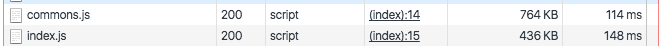

## webpack optimize

webpack 打包后文件通常比较大，优化主要是做瘦身。
先看看优化后的 webpack configuration file:
```js
const webpack = require('webpack');
const path = require('path');
const buildPath = path.resolve(__dirname, 'build');
const nodeModulesPath = path.resolve(__dirname, 'node_modules');

const config = {
  // Entry points to the project
  entry: {
    commons : [
        path.join(nodeModulesPath,'/material-ui'),
        //path.join(nodeModulesPath,'/react/dist/react.min'),
        //path.join(nodeModulesPath,'/react-dom/dist/react-dom.min'),
    ],
    index : [
        'webpack/hot/dev-server',
        'webpack/hot/only-dev-server',
        path.join(__dirname, '/static/app.js'),
    ]
  },
  devServer: {
    contentBase: './', // Relative directory for base of server
    //devtool: 'eval', // 当有任何报错的时候可以让你更加精确地定位到文件和行号
    hot: true, // Live-reload
    inline: true, //自动刷新
    port: 3000, // Port Number
    host: 'localhost', // Change to '0.0.0.0' for external facing server
  },
  devtool: false, // eval, inline-source-map
  output: {
    path: buildPath, // Path of output file
    filename: '[name].js',
    //filename: "[hash:8].[name].min.js",
  },
  plugins: [
    // Enables Hot Modules Replacement
    new webpack.HotModuleReplacementPlugin(),
    // Allows error warnings but does not stop compiling.
    new webpack.NoErrorsPlugin(),
    new webpack.optimize.CommonsChunkPlugin({
        name: "commons",
        chunks: ["commons"]
    }),
    new webpack.optimize.UglifyJsPlugin({
        compress: {warnings: false}
    }),
],
resole : {
extensions : ["",".js",".jsx",".css",".scss",".png",".jpg",".jpeg",".gif"],
alias : {
    "react" : path.join(nodeModulesPath,'/react/dist/react.min'),
    "react-dom" : path.join(nodeModulesPath,'/react-dom/dist/react-dom.min'),
},
},
module: {
noParse : [
    path.join(nodeModulesPath,'/react/dist/react.min'),
    path.join(nodeModulesPath,'/react-dom/dist/react-dom.min')
],
loaders: [
  {
    // React-hot loader and
    test: /\.js$/, // All .js files
    loaders: ['babel-loader'], // react-hot is like browser sync and babel loads jsx and es6-7
    exclude: [nodeModulesPath],
  },
],
},
};

module.exports = config;
```


### 业务代码和公共库分开

commons 和 index 将会作为打包后的文件名。
```js
entry: {
  commons : [
      path.join(nodeModulesPath,'/material-ui'),
      //path.join(nodeModulesPath,'/react/dist/react.min'),
      //path.join(nodeModulesPath,'/react-dom/dist/react-dom.min'),
  ],
  index : [
      'webpack/hot/dev-server', // 开发环境需要把 webpac-dev-server 一起打包
      'webpack/hot/only-dev-server',
      path.join(__dirname, '/static/app.js'),
  ]
},
```

### 禁用 source-map
devtool: false, // eval, inline-source-map

### loader不加载node_modules目录

```js
 loaders: [
      {
        // React-hot loader and
        test: /\.js$/, // All .js files
        loaders: ['babel-loader'], // react-hot is like browser sync and babel loads jsx and es6-7
        exclude: [nodeModulesPath],  //不加载node_modules目录
      },
  ]
```

### 抽取公共代码到一个新的chunk里
有些时候业务代码会有重复函数，该插件可以把重复代码抽取出来放到一个新的文件里。

```js
  new webpack.optimize.CommonsChunkPlugin({
       name: "commons",
       chunks: ["commons"]
   }),
```

### 减小文件大小的最有效的方法

```js
   new webpack.optimize.UglifyJsPlugin({
        compress: {warnings: false}
    }),
```



尽管做了这些优化，文件大小还是不够理想，后面试试 webpack2  和 rollup.js.
